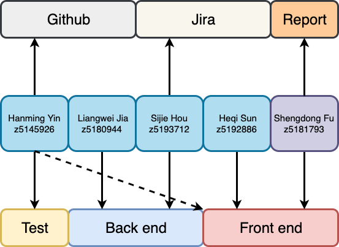

## Week 1
 - **Group formation and assignment**  
 
 We have allocated tasks successfully, the details shown below  
 
 	- Coding Part
 		- Front end: Shengdong FU & Heqi Sun
 		- Back end: Sijie Hou, Liangwei Jia & Hanming Yin
 		- Test: Hanming Yin
 		
 	- Project Part
 		- Report: Shengdong Fu
 		- Jira: Sijie Hou
 		- Github: Hanming Yin
 
 
 
 - **Confirmation on programming language and framework**
 
 After fully discussing, we decided to utilize:  
 
 	- Front end: React based on Json  
 	- Back end: Flask based on Python  
 	- Databse: Sqlite  
 	- Email: Not confirmed  
 	- Middleware: MessageQueue and so on if time left before ddl  
 	
 All of those will be changed if necessary within the period of developing.
 
## Week 2
 - Clarify specific requirements of application
 - List moudles and fuctions regarding to requirements
 - Establish appropriate code style and API
 - Start to finish own part individually